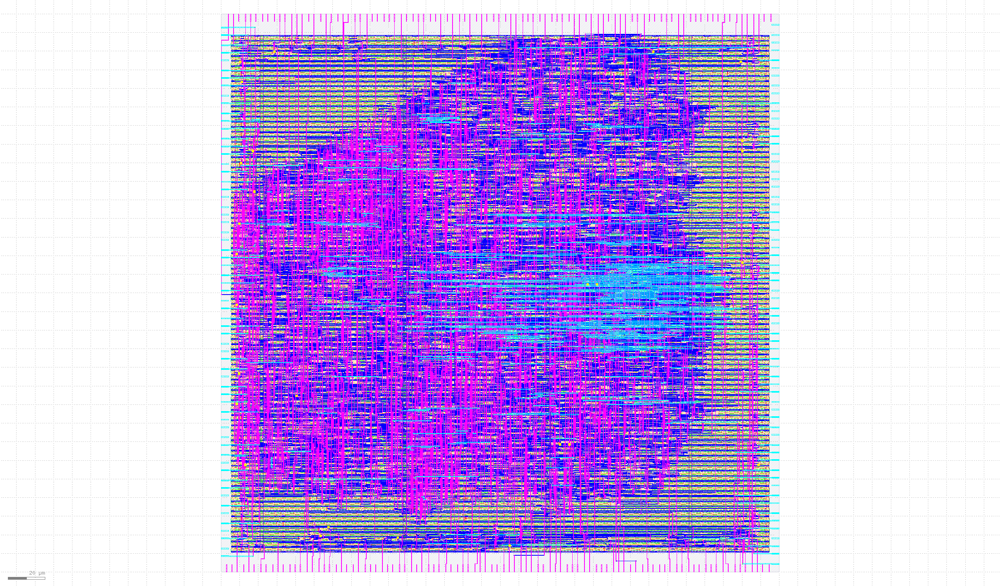

# A5/1 Wishbone Accelerator

This is a hard macro for SKY130A to generate A5/1 keystream for the management
SOC on Caravel.  This is part of the [zerotoasic](https://www.zerotoasiccourse.com/) multi project submission to fit within a 300um x 300um area.



## Building

```
$ mkdir _build
$ make O=$(pwd)/_build harden
```

## Tests

```
# RTL tests:
$ make O=$(pwd)/_build test_wrapper
# Gate level tests
$ make O=$(pwd)/_build test_gl
# Caravel tests
$ make O=$(pwd)/_build test_caravel
# Caravel gate level tests
$ make O=$(pwd)/_build test_caravel_gl
```

Caravel tests need several environment variables set:

 - `CARAVEL_ROOT=<PATH_TO_CARAVEL>`
 - `GCC_PATH=<PATH_TO_RISCV_GCC>`
 - `GCC_PREFIX=riscv64-unknown-elf`
 - `PDK_PATH=$PDKPATH`

## References

https://en.wikipedia.org/wiki/A5/1
